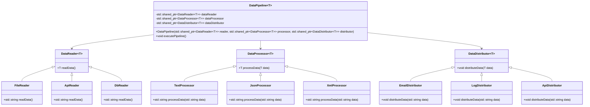

# Linux Debugging Application
This is a Linux debugging application for interfacing, processing and communicating data from different protocols.

```mermaid
classDiagram
    class DataReader~T~ {
        +T readData()
    }

    class FileReader {
        +std::string readData()
    }
    DataReader~T~ <|-- FileReader

    class ApiReader {
        +std::string readData()
    }
    DataReader~T~ <|-- ApiReader

    class DbReader {
        +std::string readData()
    }
    DataReader~T~ <|-- DbReader

    class DataProcessor~T~ {
        +T processData(T data)
    }

    class TextProcessor {
        +std::string processData(std::string data)
    }
    DataProcessor~T~ <|-- TextProcessor

    class JsonProcessor {
        +std::string processData(std::string data)
    }
    DataProcessor~T~ <|-- JsonProcessor

    class XmlProcessor {
        +std::string processData(std::string data)
    }
    DataProcessor~T~ <|-- XmlProcessor

    class DataDistributor~T~ {
        +void distributeData(T data)
    }

    class EmailDistributor {
        +void distributeData(std::string data)
    }
    DataDistributor~T~ <|-- EmailDistributor

    class LogDistributor {
        +void distributeData(std::string data)
    }
    DataDistributor~T~ <|-- LogDistributor

    class ApiDistributor {
        +void distributeData(std::string data)
    }
    DataDistributor~T~ <|-- ApiDistributor

    class DataPipeline~T~ {
        -std::shared_ptr~DataReader~T~~ dataReader
        -std::shared_ptr~DataProcessor~T~~ dataProcessor
        -std::shared_ptr~DataDistributor~T~~ dataDistributor
        +DataPipeline(std::shared_ptr~DataReader~T~~ reader, std::shared_ptr~DataProcessor~T~~ processor, std::shared_ptr~DataDistributor~T~~ distributor)
        +void executePipeline()
    }
    DataPipeline~T~ --> DataReader~T~
    DataPipeline~T~ --> DataProcessor~T~
    DataPipeline~T~ --> DataDistributor~T~
```
